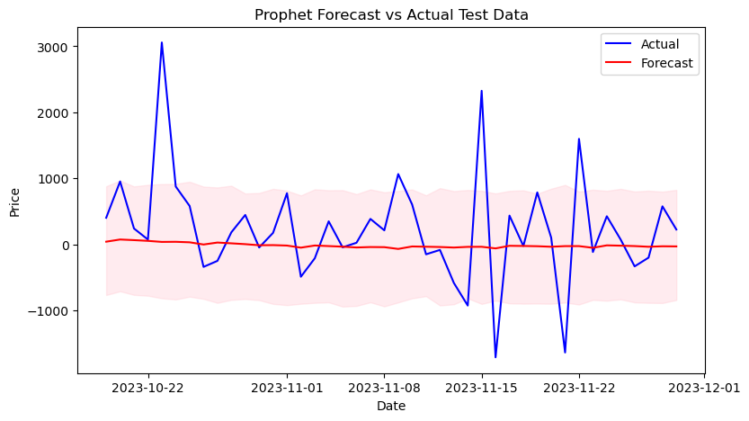

# Bitcoin Price Prediction - Summary

Project presentation link : https://prezi.com/view/adCc7sO1A9eMC547Yk7J/

## Overview

This project focuses on predicting Bitcoin prices against USD using different time series models. The project aims to provide valuable insights for traders and investors by leveraging historical price data.

## A Brief History of Bitcoins 
Bitcoin is the first decentralized cryptocurrency. Nodes in the peer-to-peer bitcoin network verify transactions through cryptography and record them in a public distributed ledger, called a blockchain, without central oversight.Here is a brief video about bitcoins by BBC https://www.youtube.com/watch?v=SzAuB2FG79A

It was invented in 2008 by [Satoshi Nakamoto](https://en.wikipedia.org/wiki/Satoshi_Nakamoto), an anonymous person and its use as a currency began in 2009.

In 2010, the first known commercial transaction using bitcoin occurred when programmer Laszlo Hanyecz bought two Papa John's pizzas for \₿10,000.

## Problem Statement
Cryptocurrency trading is complex, risky, and the prices are unpredictable, which causes many investors to lose their lifetime savings. Many pundits and critics have constantly insisted that bitcoin and other crypocurrencies are a bubble waiting to burst one last time!

Consider these scenarios:

    From 8th to 12th March 2020, the price of Bitcoin fell by 30 percent from USD8,901 to USD6,206.

    After another surge on 3rd January 2021 with USD34,792.47, Bitcoin crashed by 17 percent the next day.

    Following a small correction in February 2021, Bitcoin plunged from its peak above USD64,000 on 14th April to below USD49,000 on 23rd April, representing a 23% mini-crash in less than 10 days.

Our model will simply provide investors with a forecast of bitcoin prices up to any number of days they wish so that they can plan their buying and selling accordingly.

## Key Features

- **Data Source:** The dataset is sourced from [investing.com](https://investing.com/), spanning from July 18, 2010, to the present day. It includes daily Bitcoin vs USD exchange rates, opening/closing prices, high/low prices, trading volume, and daily percentage changes.

- **Business Objective:** Develop a robust model capable of accurately forecasting daily Bitcoin prices to assist traders and investors in making informed decisions.

## Project Structure

### 1. Exploratory Data Analysis (EDA)

- **Data Understanding:** Load and inspect the dataset, exploring key metrics.
- **Data Cleaning:** Handle missing values, duplicates, and check data types.
- **Exploratory Data Analysis (EDA):** Visualize closing prices and daily returns over time.
- **Feature Engineering:** Create additional relevant features, such as daily returns.

### 2. Model Development

#### Time Series Models

- **ARIMA (AutoRegressive Integrated Moving Average):** Utilize the SARIMAX model to predict Bitcoin prices. The optimal order is determined using the auto_arima function.

#### Machine Learning Models

- **LSTM (Long Short-Term Memory):** Implement a deep learning model for prediction. Data is preprocessed using MinMax scaling, and the dataset is split into training and testing sets.

- **Facebook Prophet Model:** Utilize the Prophet model for forecasting univariate time series data. Evaluate and compare the performance with other models.

#### Vector Autoregressive (VAR) Model

- Use VAR to model the interdependence between price, volume, and change features.

### 3. Model Evaluation

- Assess the performance of each model using appropriate metrics.
- Compare the accuracy of time series models, machine learning models, and the VAR model.

### 4. Model Deployment

- Deploy the Facebook Prophet model for real-time data extraction and forecasting.

- Create a Streamlit web app for users to interact with the deployed model.

## Results

- The project evaluates the effectiveness of various models in predicting Bitcoin prices, considering both univariate and multivariate approaches.
- The Facebook Prophet model on 1-lag differenced series outperforms other models, achieving an RMSE of 855.996.

## Contributors

- **Leonard Gachimu**
- **Francis Njenga**
- **Thomas Okiwi** 

## Acknowledgments

- Special thanks to [investing.com](https://investing.com/) for providing the dataset.
- This project is inspired by the dynamic nature of cryptocurrency trading and the need for accurate price predictions.

## License

This project is licensed under the [MIT License](LICENSE).

Feel free to contribute, raise issues, or use the code for your own analysis!
